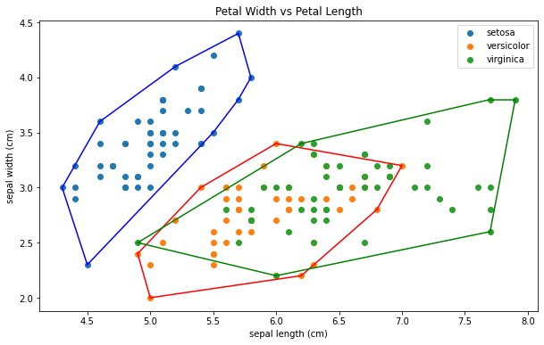

# Tugas Kecil Strategi Algoritma 2
Implementasi Convex Hull untuk Visualisasi Tes Linear Separability Dataset 
dengan Algoritma  _Divide and Conquer_

contoh untuk beberapa datasets dapat dilihat pada file **main.ipynb**

## Deskripsi Singkat Program yang Dibuat
Salah satu hal penting dalam komputasi
geometri adalah menentukan convex hull dari kumpulan titik. Himpunan titik
pada bidang planar disebut convex jika untuk sembarang dua titik pada bidang
tersebut (misal p dan q), seluruh segmen garis yang berakhir di p dan q berada
pada himpunan tersebut.

Ide
pengerjaannya dijabarkan di dalam poin-poin berikut ini.
1. Mengurutkan titik berdasarkan absis, jika ditemukan titik yang dengan
absis yang sama, diurutkan berdasarkan ordinatnya.
Pengurutan titik ini menggunakan algoritma quick_sort. Titik yang
diurutkan adalah titik koordinat yang terdapat di dalam datasets
2. Pilih titik yang memiliki urutan pertama dan terakhir, bentuk suatu garis
yang membagi area menjadi dua bagian (atas dan bawah)
3. Cari titik terjauh di area atas dan cari titik terjauh di area bawah,
hubungkan kedua titik tersebut dengan titik-titik yang sudah ada di dalam
himpunan penyelesaian convex hull
Pencarian titik terjauh dilakukan dengan menggunakan fungsi
jarak_titik_ke_garis
4. Lakukan secara rekursif hingga mencapai basis (tidak ada titik di atas garis
maupun di bawah garis)
5. Diperoleh himpunan penyelesaian berupa kumpulan titik, urutkan kembali
berdasarkan absisnya, kemudian cari indeksnya menggunakan fungsi
titik_menjadi_indeks
6. Tambahkan setiap pasangan indeks titik tersebut ke dalam list hasil
7. Convex hull siap untuk divisualisasikan pada file notebook

## Requirement Program dan Instalasi Module/Package yang Diperlukan
### Requirement Program
Pastikan pip Anda telah di-_upgrade_, jika belum silakan ketik python -m pip install --upgrade pip pada terminal Anda
1. Python (Lakukan instalasi melalui https://www.python.org/ atau sudo apt install python3)
2. Pandas (pip install pandas (windows), sudo apt install python3-pip (linux))
3. Matplotlib (pip install matplotlib (windows), sudo apt install python3-matplotlib (linux))
4. Sklearn (pip install sklearn (windows), sudo apt install python3-sklearn (linux))
5. Numpy (pip install numpy (windows), sudo apt install python3-numpy (linux))
6. Jupyter Notebook (python -m pip install jupyter)

## Cara Menggunakan Program
1. Siapkan _code editor_. Dalam hal ini, Anda dapat menggunakan vscode. Jika Anda belum memiliki vscode, Anda dapat melakukan instalasi dengan mengunduh aplikasi pada https://code.visualstudio.com/
2. Pastikan Anda telah melakukan instalasi bahasa _Python_ pada _device_ Anda. Jika belum, Anda dapat melakukan instalasi dengan mengunduh _python_ terbaru pada https://www.python.org/ untuk pengguna windows, atau mengetikkan sudo apt install python3 untuk pengguna Linux/Ubuntu
3. Lakukan instalasi _library_ yang diperlukan (lihat bagian _requirement program_)
4. Buka _file_ **main.ipynb**
5. Lakukan reset kernel pada vscode/_code editor_ Anda
6. Klik _run all_ untuk melihat visualisasi data

## Cara Menggunakan Fungsi myConvexHull pada Program Anda
1. Lakukan _import_ fungsi pada _file_ program Anda dengan cara mengetikan _from file_myConvexHull import myConvexHull_
2. Simpan _output_ di dalam suatu variabel
3. Tampilkan visualisasi output menggunakan matplotlib, Anda dapat melihat file main.ipynb pada _folder_ src di dalam repository ini sebagai referensinya

## Author / Identitas Pembuat
- Nama  : Hana Fathiyah
- NIM   : 1350047
- Kelas : K02
- Email : 13520047@std.stei.itb.ac.id
